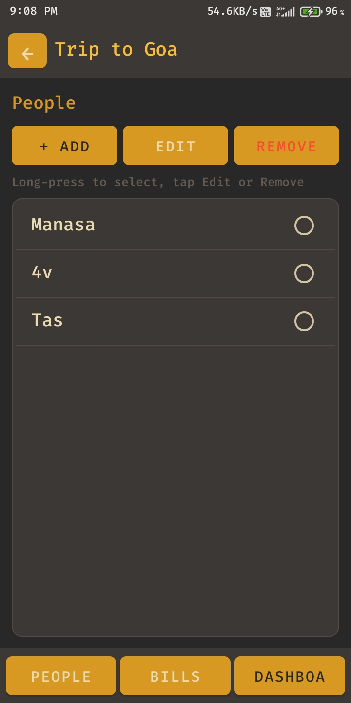
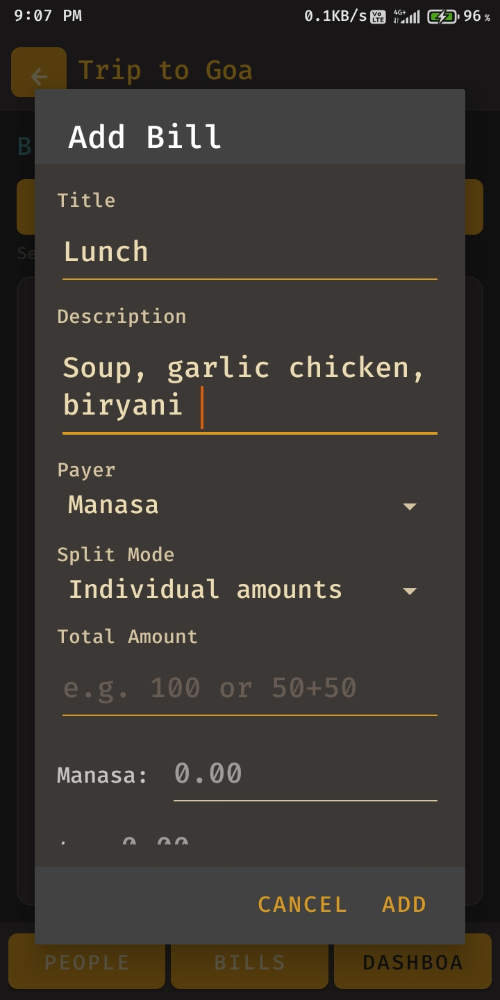
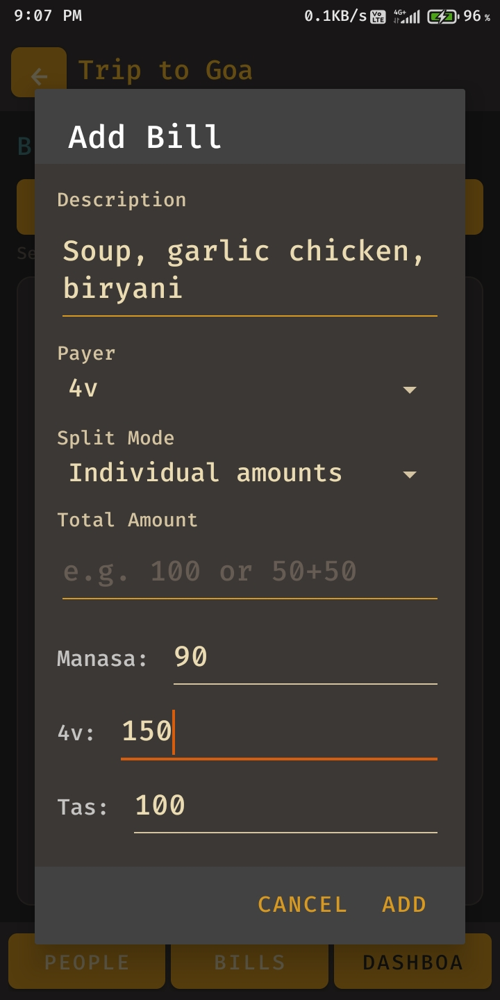
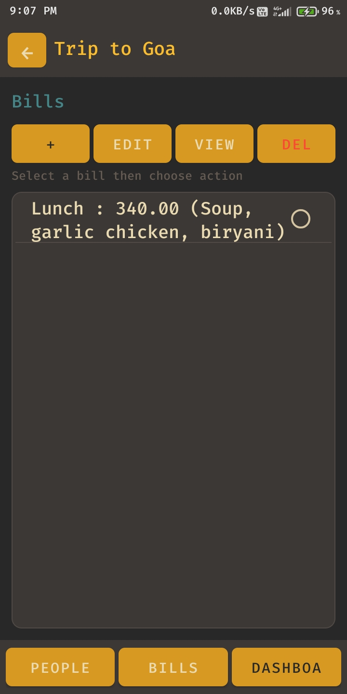
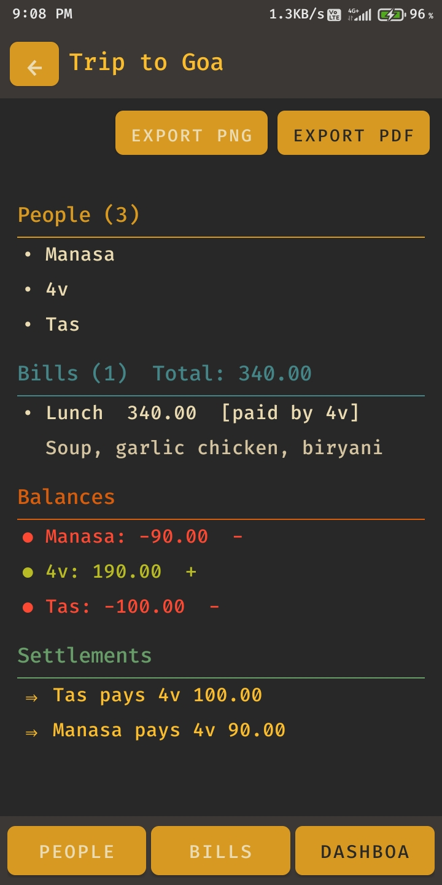

# Expense Splitter

- Smart Expense Splitter is a mobile application to automatically calculate and divide shared expenses
among multiple users

- To track payments and fairly distribute costs based on each person’s share

- To compute optimized balances and reduce the number
of transactions between users

### How to compile

```sh
# used java-17-openjdk Java environment

gradle clean
gradle assembleDebug

adb install -r app/build/outputs/apk/debug/app-debug.apk
```

### Screenshots

| | | |
|---|---|---|
|  |  |  |
|  |  |  |
